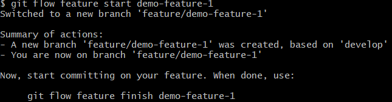
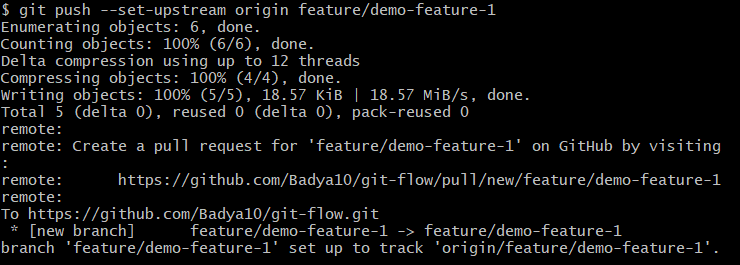

# git-flow
This repository has git-flow commands and documents for reference.

Git Flow:
- Gitflow is a legacy Git workflow that was originally a disruptive and novel strategy for managing Git branches. 

Git Flow init: Initialize git flow setup with hooks, config file, etc
Usage: 

Syntax: git flow init

Display current git branch:
Usage:

Syntax: git branch -a

Create a local feature branch using Git flow:
Usage:

Syntax: git flow feature start demo-feature-1

Push data to the newly created feature branch:
Usage:

Syntax: git push --set-upstream origin feature/demo-feature-1 (for first push) and
git push (for later pushes)

Once changes to the feature are completed, we want to merge them to the parent branch and delete the feature branch locally and on remote repository:
Usage:

Syntax: git flow feature finish demo-feature-1

