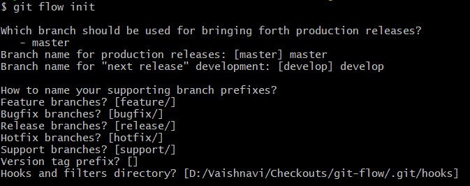

# git-flow
This repository has git-flow commands and documents for reference.

Git Flow:
- Gitflow is a legacy Git workflow that was originally a disruptive and novel strategy for managing Git branches. 

Git Flow init: Initialize git flow setup with hooks, config file, etc
Usage: 
syntax: git flow init

