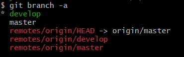
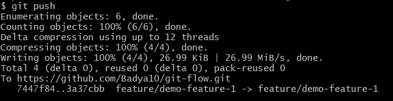
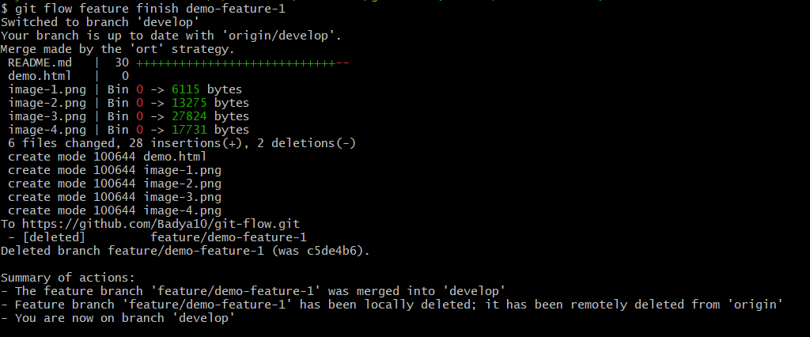
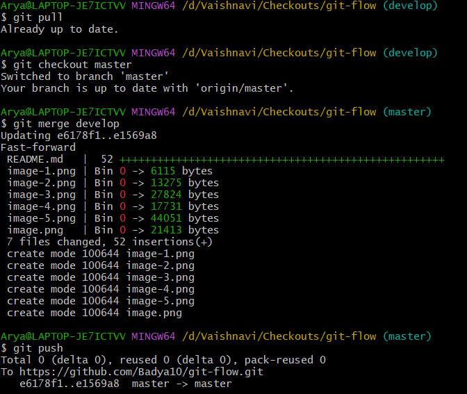

# git-flow
This repository has git-flow commands and documents for reference.

Git Flow:
- Gitflow is a legacy Git workflow that was originally a disruptive and novel strategy for managing Git branches. 

Commands:

1. Git Flow init: Initialize git flow setup with hooks, config file, etc.
You can rename your feature, develop, bugfix branches are per requirements.

Usage: 

Syntax: git flow init

-------------------------------------------------------------------------

2. Display current git branch:

Usage:

Syntax: git branch -a

-------------------------------------------------------------------------

3. Create a local feature branch using Git flow:

Usage:

Syntax: git flow feature start demo-feature-1

-------------------------------------------------------------------------

4. Push data to the newly created feature branch:

Usage:

Syntax: git push --set-upstream origin feature/demo-feature-1 (for first push) and
git push (for later pushes)

-------------------------------------------------------------------------

5. Once changes to the feature are completed, we want to merge them to the parent branch and delete the feature branch locally and on remote repository

Usage:

Syntax: git flow feature finish demo-feature-1
Note: These changes are done locally so git push is required for the changes to be reflected on remote repository.

-------------------------------------------------------------------------

6. Merge a branch in parent branch:

Usage:

Syntax: 
Note: git pull is necessary in child as well as parent branches before merging to avoid conflicts.

-------------------------------------------------------------------------

